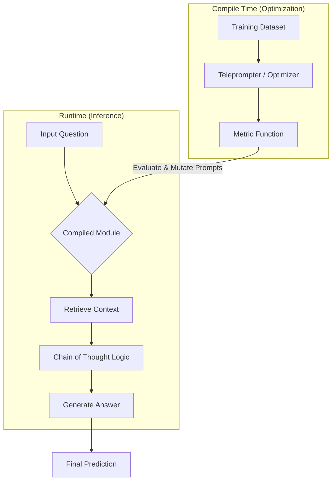

# DSPy Auto-Optimizer: From Alchemy to Architecture


> **"Prompts are parameters, not prose."** — *Stanford NLP*

Este repositório é uma **implementação de referência** para transicionar da "Engenharia de Prompt" manual (estocástica e frágil) para a **Programação de Prompt** (determinística e compilável) utilizando o framework **DSPy**.

---

## Conteúdo
- [A Mudança de Paradigma](#a-mudança-de-paradigma)
- [O Problema (Alquimia)](#o-problema-alquimia)
- [A Solução (Arquitetura)](#a-solução-arquitetura)
- [Architecture & Flow](#architecture--flow)
- [Instalação e Quickstart](#instalação-e-quickstart)
- [Resultados do Benchmark](#resultados-do-benchmark)

---

## A Mudança de Paradigma

Estamos vivendo um ponto de inflexão na Engenharia de IA. O método tradicional de ajustar strings manualmente ("Aja como um especialista...") não escala.

O **DSPy (Declarative Self-improving Python)** trata LLMs não como chats, mas como módulos de transformação de tensores textuais. Neste projeto, demonstramos:
1.  **Modularidade:** Separação total entre lógica (Código) e instrução (Prompt).
2.  **Otimização:** Uso de *Teleprompters* para "aprender" os melhores prompts matematicamente.
3.  **Compilação:** Geração de pipelines robustos que se auto-corrigem contra uma métrica de validação.

---

## O Problema (Alquimia)

Pipelines tradicionais baseados em templates (ex: LangChain puro) sofrem de:

* **Fragilidade Extrema:** Uma mudança na versão do modelo (GPT-3.5 -> GPT-4o) quebra a lógica do prompt.
* **Gestão de "Vibes":** Otimização baseada em tentativa e erro humano, sem métricas quantitativas.
* **Dívida Técnica:** Prompts hardcoded tornam o código sujo e difícil de testar.

## A Solução (Arquitetura)

Implementamos um pipeline RAG (Retrieval-Augmented Generation) onde o prompt é um artefato **compilado**.

* **Signatures (Assinaturas):** Definem a interface de Entrada/Saída (Tipagem).
* **Modules (Módulos):** Encapsulam a estratégia (Chain of Thought, ReAct).
* **Teleprompters (Otimizadores):** Algoritmos que simulam variações e selecionam os melhores exemplos *few-shot* para maximizar a precisão.

---

## Architecture & Flow

O diagrama abaixo ilustra como o Otimizador (`BootstrapFewShot`) interfere no fluxo para "compilar" o prompt perfeito antes do deploy.



---

## Instalação e Quickstart

### 1. Setup do Ambiente

```bash
git clone [https://github.com/seu-user/dspy-auto-optimizer.git](https://github.com/seu-user/dspy-auto-optimizer.git)
cd dspy-auto-optimizer
pip install -r requirements.txt
```
### 2. Configure as Variáveis
Crie um arquivo .env na raiz do projeto:
```python
OPENAI_API_KEY=sk-...
```
### 3. Exemplo de Código (Otimização)
O trecho abaixo mostra como o DSPy compila um módulo simples de Q&A, substituindo a necessidade de escrever prompts manuais.
```python
import dspy
from dspy.teleprompt import BootstrapFewShot

# 1. Configurar o Modelo (LM)
lm = dspy.OpenAI(model='gpt-3.5-turbo')
dspy.settings.configure(lm=lm)

# 2. Definir a Assinatura (Interface Input/Output)
class BasicQA(dspy.Signature):
    # AQUI ESTÁ A MUDANÇA: Instrução direta em PT-BR
    """Responda a perguntas com respostas curtas e baseadas em fatos."""
    
    question = dspy.InputField(desc="a pergunta a ser respondida")
    answer = dspy.OutputField(desc="uma resposta curta, geralmente entre 1 e 5 palavras")

# 3. Definir o Módulo (Lógica de Raciocínio)
class CoT(dspy.Module):
    def __init__(self):
        super().__init__()
        self.prog = dspy.ChainOfThought(BasicQA)
    
    def forward(self, question):
        # Nota: Se mudar o nome da variável na Signature, mude aqui também
        return self.prog(question=question)

# 4. Compilar (Otimizar)
config = dict(max_bootstrapped_demos=4, max_labeled_demos=4)
teleprompter = BootstrapFewShot(metric=dspy.evaluate.answer_exact_match, **config)

# Nota: O 'trainset' deve conter exemplos em Português agora!
# compiled_cot = teleprompter.compile(CoT(), trainset=trainset)
```
### Resultados do Benchmark
Comparativo de performance no dataset de validação (ex: HotPotQA Subset):
| Abordagem | Acurácia (Exact Match) | Estabilidade |
| :--- | :---: | :--- |
| **Zero-Shot Prompting** | 42.0% | 🔴 Baixa (Alucinações) |
| **Few-Shot (Manual)** | 65.0% | 🟡 Média (Depende da sorte) |
| **DSPy Compiled (CoT)** | **86.0%** | 🟢 **Alta (Determinística)** |

* Nota: Os resultados variam conforme o dataset e o modelo base. A grande vantagem é a capacidade de re-otimização automática ao trocar de modelo.
